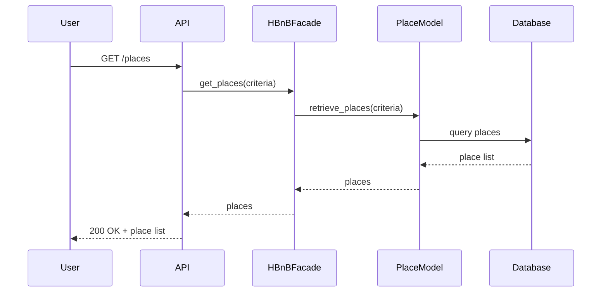

# Fetch Places Sequence Diagram

```mermaid
sequenceDiagram
    participant User
    participant API
    participant HBnBFacade
    participant PlaceModel
    participant Database

    User->>API: GET /places
    API->>HBnBFacade: get_places(criteria)
    HBnBFacade->>PlaceModel: retrieve_places(criteria)
    PlaceModel->>Database: query places
    Database-->>PlaceModel: place list
    PlaceModel-->>HBnBFacade: places
    HBnBFacade-->>API: places
    API-->>User: 200 OK + place list
```

## Description

This diagram shows how the application retrieves and returns a list of places matching the user's search criteria.
