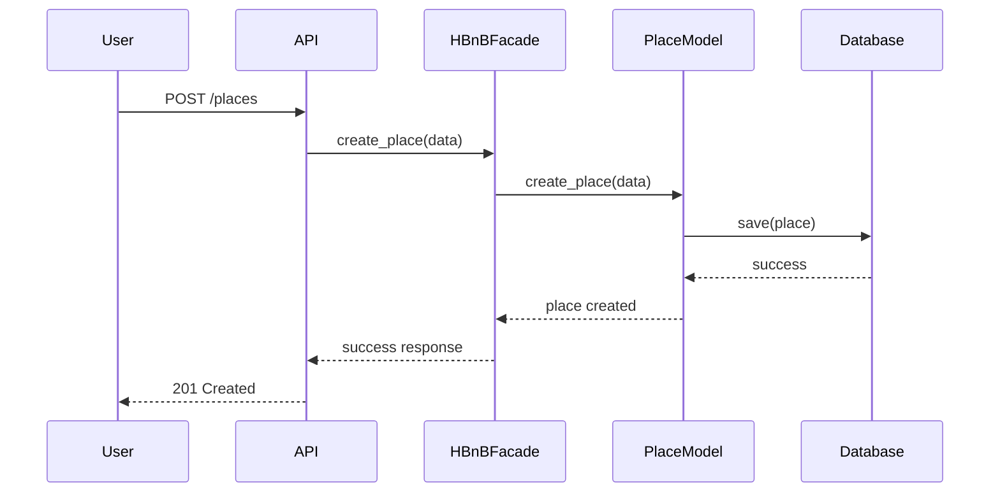

# Place Creation Sequence Diagram

```mermaid
sequenceDiagram
    participant User
    participant API
    participant HBnBFacade
    participant PlaceModel
    participant Database

    User->>API: POST /places
    API->>HBnBFacade: create_place(data)
    HBnBFacade->>PlaceModel: create_place(data)
    PlaceModel->>Database: save(place)
    Database-->>PlaceModel: success
    PlaceModel-->>HBnBFacade: place created
    HBnBFacade-->>API: success response
    API-->>User: 201 Created
```

## Description

This diagram shows how a user creates a place listing. The request is validated and processed before being persisted in the database.
