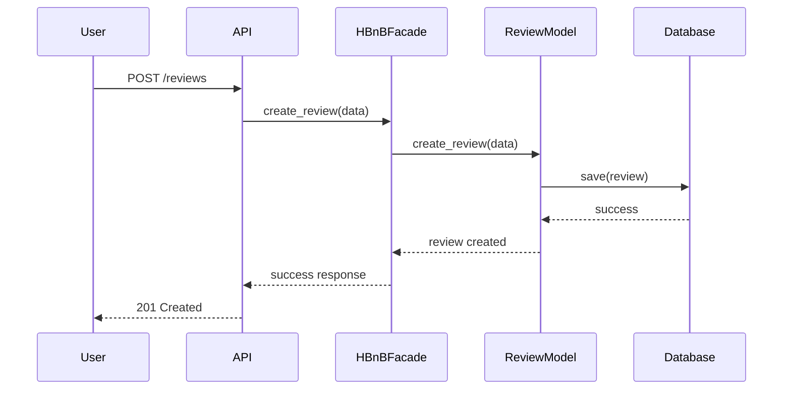

# Review Submission Sequence Diagram

```mermaid
sequenceDiagram
    participant User
    participant API
    participant HBnBFacade
    participant ReviewModel
    participant Database

    User->>API: POST /reviews
    API->>HBnBFacade: create_review(data)
    HBnBFacade->>ReviewModel: create_review(data)
    ReviewModel->>Database: save(review)
    Database-->>ReviewModel: success
    ReviewModel-->>HBnBFacade: review created
    HBnBFacade-->>API: success response
    API-->>User: 201 Created
```

## Description

This diagram illustrates the submission of a review associated with a user and a place.
