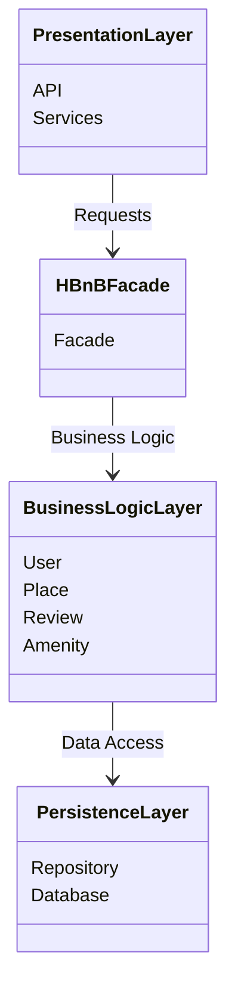

# High-Level Package Diagram

## Diagram

## Layer Responsibilities

### Presentation Layer
Handles user interactions through APIs and services.

### Business Logic Layer
Contains the application's core entities:
- User
- Place
- Review
- Amenity

This layer implements the business rules.

### Persistence Layer
Responsible for storing and retrieving data from the database.

## Facade Pattern

The `HBnBFacade` acts as a unified interface between the Presentation Layer and the Business Logic Layer.

Instead of interacting directly with models, the Presentation Layer communicates with the facade, which simplifies the architecture and reduces coupling.
