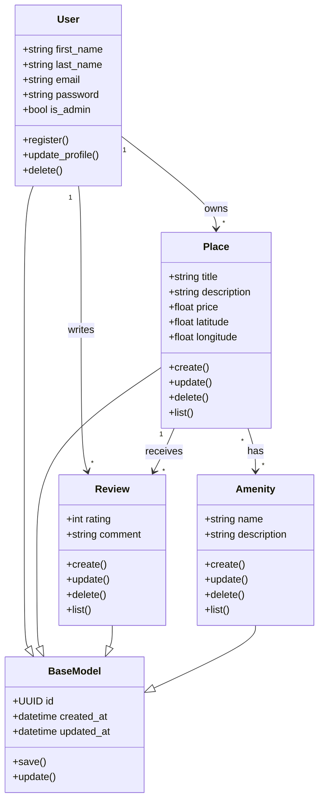

# Detailed Class Diagram for Business Logic Layer

## Diagram

## Explanatory Notes

### BaseModel
BaseModel contains the common attributes shared by all entities: `id`, `created_at`, and `updated_at`.

### User
The User entity represents a registered user. A user has a first name, last name, email, password, and `is_admin` status.

### Place
The Place entity represents a property listed by a user. It has a title, description, price, latitude, longitude, and an owner.

### Review
The Review entity represents feedback left by a user for a place. It includes a rating and a comment.

### Amenity
The Amenity entity represents features that can be linked to places, such as WiFi, parking, or a pool.

## Relationships

A User can own many Places.

A User can write many Reviews.

A Place can receive many Reviews.

A Place can have many Amenities, and an Amenity can belong to many Places.
