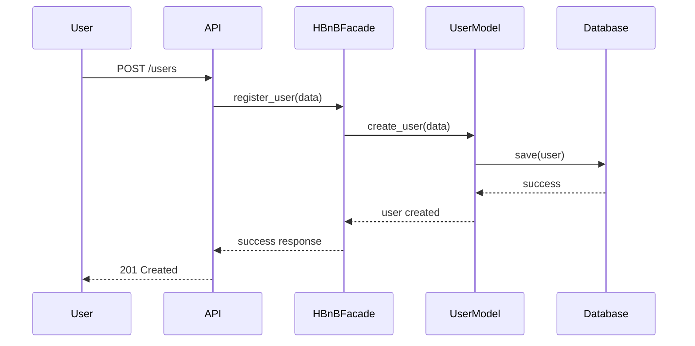

# User Registration Sequence Diagram

## Description

This diagram illustrates the process of user registration. The request flows from the API layer through the facade and business logic layer before being stored in the database.
